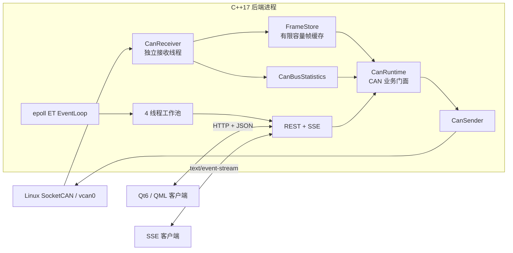

# CAN Telemetry Monitor

> C++17 / Linux SocketCAN / epoll Reactor / REST + SSE / Qt6 QML

CAN Telemetry Monitor 是一个面向车辆模块开发与台架测试场景的 CAN 总线监控平台。Linux 后端负责 SocketCAN 帧收发、缓存、统计和 HTTP 数据服务；Qt6/QML 客户端通过 REST 增量查询展示实时帧、接收速率和估算总线负载，并支持远程发送 CAN 帧。

项目可以在没有真实 CAN 硬件时使用 Linux `vcan0` 完成收发闭环、自动化测试、并发压测和内存检查。

## 项目亮点

- 使用 C++17 封装 Linux SocketCAN，支持经典 CAN 标准帧、扩展帧收发和内核级 ID 过滤。
- CAN 接收线程将帧写入有限容量 `FrameStore`，通过单调递增 `sequence` 支持增量查询和缺口检测。
- 基于 epoll ET + 非阻塞 Socket + 4 线程工作池实现 HTTP 服务，提供 REST 查询、远程发送和 SSE 实时推送。
- 使用 `shared_ptr` 管理连接生命周期，并以连接级锁和连接表互斥保护异步读写及关闭流程。
- Qt6/QML 客户端包含实时帧表、负载曲线、统计指标和远程发送表单。
- 提供 CTest、vcan loopback、wrk、10 路 SSE 完整性检查和 Valgrind 自动化脚本。

## 系统架构



### 数据链路

```text
CAN/vcan0
   ↓
CanReceiver 后台线程
   ↓
FrameStore + CanBusStatistics
   ↓
CanRuntime
   ↓
REST / SSE
   ↓
Qt6/QML 客户端或其他远程客户端
```

QML 客户端当前每 500 ms 请求一次统计接口和增量帧接口。服务端另外提供 SSE 长连接，供需要服务端主动推送的客户端使用。

## 性能验证

以下为 2026-08-25 在 Ubuntu Release、本机回环环境中的一次可复现测试结果。测试脚本位于 [`scripts/benchmark_all.sh`](scripts/benchmark_all.sh)。由于当次记录未包含 CPU 型号和 CPU/RSS，结果只表示该机器和参数下的观测值，不代表跨机器或真实车辆网络性能。

| 测试 | 参数 | 结果 |
|---|---|---|
| REST 混合负载 | wrk 4 线程、100 keep-alive 连接、30 秒；同时向 vcan0 注入 60,000 帧，目标 2,000 fps；每次查询最多 100 帧 JSON | 28,604.40 req/s，平均 3.49 ms，p99 4.67 ms，最大 12.91 ms |
| SSE 完整性 | 10 客户端通过 Barrier 同步 ready；1,000 fps 注入 1,000 帧 | 10,000/10,000 次客户端事件交付，lost/duplicate/gap/out-of-order 均为 0；平均 54.676 ms，p99 101.926 ms |
| Valgrind | CAN loopback；HTTP + 2 路 SSE + SIGINT 正常退出 | 两轮 `ERROR SUMMARY: 0`，alloc/free 次数相等 |

SSE 的约 102 ms p99 与当前 EventLoop 的 100 ms polling timeout 相符。该延迟适合面向人的监控界面，不属于硬实时控制链路。若需要进一步降低延迟，可使用 `eventfd` 从 CAN 接收线程即时唤醒 HTTP EventLoop。

## 环境要求

- Linux，推荐 Ubuntu 22.04 或更新版本
- CMake 3.20+
- 支持 C++17 的 GCC 或 Clang
- SocketCAN / `can-utils`
- 可选：Qt 6.2+，用于构建 QML 客户端
- 可选：wrk、Valgrind、Python 3，运行完整基准测试

Ubuntu 22.04 安装依赖：

```bash
sudo apt update
sudo apt install -y build-essential cmake can-utils \
  qt6-base-dev qt6-declarative-dev \
  qml6-module-qtquick-controls qml6-module-qtquick-layouts \
  qml6-module-qtqml-workerscript qml6-module-qtquick-templates \
  qml6-module-qtquick-window
```

## 快速开始

### 1. 创建虚拟 CAN 接口

```bash
sudo modprobe vcan
sudo ip link add dev vcan0 type vcan 2>/dev/null || true
sudo ip link set dev vcan0 up
ip -details link show vcan0
```

仓库也提供了脚本：

```bash
chmod +x scripts/*.sh scripts/*.py
./scripts/vcan_up.sh
```

### 2. 构建后端和测试

```bash
cmake -S . -B build/debug \
  -DCMAKE_BUILD_TYPE=Debug \
  -DBUILD_TESTING=ON

cmake --build build/debug -j"$(nproc)"
ctest --test-dir build/debug --output-on-failure
```

也可以使用 CMake Preset：

```bash
cmake --preset debug
cmake --build --preset debug
ctest --preset debug
```

### 3. 启动服务端

```bash
CAN_INTERFACE=vcan0 ./build/debug/http_server
```

默认监听：

```text
0.0.0.0:8080
```

浏览器访问：

```text
http://127.0.0.1:8080/
```

### 4. 构建并启动 QML 客户端

服务端运行后，在另一个终端执行：

```bash
cmake -S . -B build/qml-debug \
  -DCMAKE_BUILD_TYPE=Debug \
  -DBUILD_QML_CLIENT=ON

cmake --build build/qml-debug -j"$(nproc)"
./build/qml-debug/can_qml_monitor
```

### 5. 发送测试帧

```bash
candump vcan0
cansend vcan0 123#11223344
```

## REST 与 SSE 接口

| 方法 | 路径 | 作用 |
|---|---|---|
| `GET` | `/api/can/frames?after=0&limit=100` | 增量查询最近 CAN 帧 |
| `GET` | `/api/can/frames?id=0x123&limit=20` | 按 CAN ID 查询 |
| `GET` | `/api/can/stats` | 查询累计帧数、帧率和估算负载 |
| `POST` | `/api/can/send` | 远程发送 CAN 帧 |
| `GET` | `/api/can/stream?after=0` | 建立 SSE 实时流 |

查询帧：

```bash
curl 'http://127.0.0.1:8080/api/can/frames?after=0&limit=20'
```

发送帧：

```bash
curl -X POST http://127.0.0.1:8080/api/can/send \
  -H 'Content-Type: application/json' \
  -d '{"id":"0x123","extended":false,"data":[17,34,51,68]}'
```

打开 SSE：

```bash
curl -N 'http://127.0.0.1:8080/api/can/stream?after=0'
```

## 测试与诊断

### 单元测试和 vcan loopback

```bash
ctest --test-dir build/debug --output-on-failure
./build/debug/can_loopback_demo
```

### ASan / UBSan

```bash
cmake --preset asan
cmake --build --preset asan
ctest --preset asan
```

### TSan

```bash
cmake --preset tsan
cmake --build --preset tsan
ctest --preset tsan
```

### 一键性能和内存检查

```bash
sudo apt install -y valgrind wrk python3 curl can-utils
chmod +x scripts/*.sh scripts/*.py
./scripts/benchmark_all.sh
```

脚本按 REST、SSE、Valgrind 三个阶段分别运行，并在阶段间重启服务，避免缓存数据和工具开销相互污染。结果保存在 `benchmarks/时间戳/`。

可通过环境变量调整测试规模：

```bash
REST_FLOOD_RATE=2000 REST_FLOOD_FRAMES=60000 \
SSE_CLIENTS=10 SSE_RATE=1000 SSE_FRAMES=1000 \
./scripts/benchmark_all.sh
```

## 代码结构

```text
include/                    C++ 头文件
src/                        HTTP、Reactor 与 CAN 后端实现
  EventLoop.cpp             epoll ET 事件循环与连接调度
  Connection.cpp            HTTP 路由、REST JSON 与 SSE
  ThreadPool.cpp            固定工作线程池
  CanReceiver.cpp           SocketCAN 接收线程和内核过滤
  CanSender.cpp             SocketCAN 发送
  FrameStore.cpp            有界线程安全帧仓库
  CanBusStatistics.cpp      帧率和总线负载统计
  CanRuntime.cpp            CAN 业务门面
qml_client/                 Qt6/QML 桌面客户端
tests/                      单元测试与 vcan loopback
scripts/                    环境配置、压测和内存检查
wwwroot/                    可选的浏览器接口演示
```

## 关键设计

### 连接生命周期

EventLoop 的连接表保存 `shared_ptr<Connection>`。向线程池提交任务时按值捕获该智能指针，保证异步任务完成前连接对象不会被提前析构。连接级锁保护同一连接的收发缓冲区，连接表互斥保护 fd 到连接对象的映射；读事件处理后会再次校验连接身份，避免连接已关闭或 fd 被复用时继续写入旧对象。

### CAN 帧存储

`FrameStore` 使用有限容量容器保存最近帧，避免监控程序长期运行导致内存无限增长。每帧带有单调递增 `sequence`，REST 和 SSE 客户端可以增量读取、去重并判断是否出现序号缺口。

### SSE 背压

SSE 连接不结束当前 HTTP 响应，服务端持续向同一 Socket 的发送缓冲区追加事件。项目提供心跳、断开清理和有界待发送缓冲；慢客户端超过缓冲上限时会被主动关闭，防止单个连接无限占用内存。

## 当前边界

- 当前使用 `vcan0` 完成软件闭环，真实 USB-CAN 还需补充硬件型号、比特率和长期稳定性测试。
- 总线负载为基于经典 CAN 帧位数模型的估算，不替代硬件分析仪结果。
- QML 客户端当前使用 REST 增量轮询，尚未直接消费 SSE。
- 暂未实现 DBC 信号解析、SQLite 日志回放、UDS 诊断、TLS 和鉴权。
- 当前 SSE 延迟主要受 100 ms 轮询周期影响，可通过 `eventfd` 唤醒优化。

## 后续计划

1. 增加 DBC 文件解析与物理信号解码。
2. 使用 SQLite 保存历史帧并支持条件查询与离线回放。
3. 使用 `eventfd` 打通 CAN 接收线程与 HTTP EventLoop 的即时通知。
4. 增加真实 USB-CAN、长稳、慢客户端和故障注入测试。
5. 增加 TLS、鉴权、请求体上限和更完整的 HTTP 协议校验。
